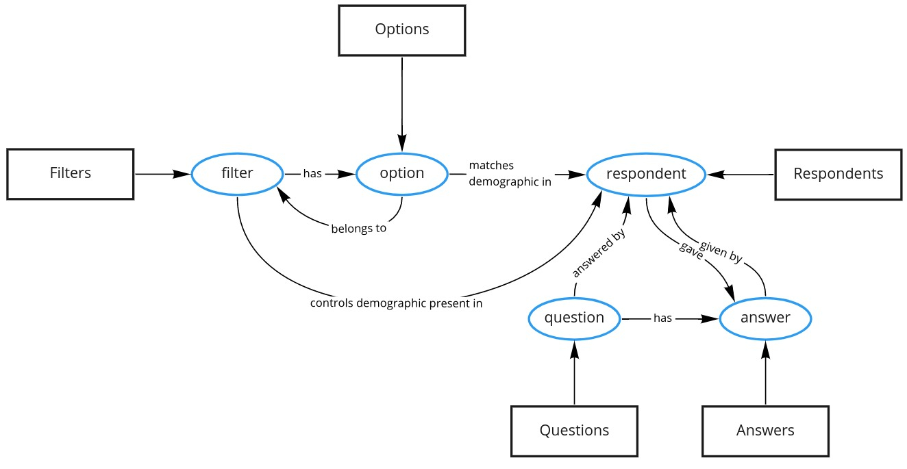

# Attest FE technical challenge

This is a boilerplate for Attest's FE technical challenge.

## Description

Attest is a platform where users can design and send surveys to the public. The Attest platform will then collect responses from many users; your task is to represent the results of a completed survey and allow the user to filter the data.

You will need to retrieve and represent survey data which contains the question and answers from the respondents. Information on the respondents that answered the survey is also provided, you will need to use this information to filter the responses. The data provided may not match the designs exactly.

A design has been provided which you will need to implement, the design is a guideline to see how well you can translate a design into code. You are free to be creative and improve the experience for the user where you see appropriate (improvements are not mandatory).

The sidebar on the right of the design is used to filter the data, i.e. clicking "London" will change the responses shown on the left to only display the responses of users that match the filters selected.

Complete test coverage is not mandatory but you will need to add some unit tests.

You will need to:

- Use the mock API to retrieve survey and filter data
- Selecting a filter in the sidebar should filter the responses displayed
- Deselecting all filters should display all responses for the question
- Care about the quality of your code, for example add unit tests.

## Rules

- No frameworks; this means no React, Vue or Angular
- TypeScript is optional, the boilerplate provided will accept TS or JS files
- We have provided all the basic tooling to ensure that you can use of common preprocessors or postprocessors

_We have outlined that your solution should not depend on any frameworks but this does not mean you cannot add and use libraries that will help you, we may discuss in a later interview on the decisions for use._

## What's included?

- A design - you can use figma to look at the design files.
  - Create an account. https://www.figma.com/
  - Import `__files__/design.fig` (default state)
  - Import `__files__/design-interactive.fig` (Interacted state)
- A webpack dev server that supports:
  - `.(css|postcss)` files - see for included base plugins `.postcssrc.js`
  - `.(less)` files
  - `.(sass|scss)` files
  - `.(stylus|styl)` files
  - `.(js|jsx)` files
  - `.(ts|tsx)` files
- Root aliasing `@/*` will map to `src/*`
- Base css variables `src/styles/vars.css`
- Jest is the provided library for unit tests.
  - We have included all the necessary packages and setup

By default we have have included `main.ts` if you wish to defer to JavaScript simply rename the file to `main.js`. If you want to use a different css preprocessor then change the extensions to the language.

## What's not included

We have given you the basics in order to run a simple application with your favourite tooling. If you wish to extend such as adding a linter, eg. eslint/stylelint, you may do so.

## How to run?

- Open up the Dev Server on `https://localhost:8080` with `yarn start`
- To retrieve the survey data make a request to `http://localhost:8080/api/survey`
- To retrieve the filter definition data make a request to `http://localhost:8080/api/filter-definition`
- To retrieve the logo make a request to `http://localhost:8080/assets/logo.svg`
- Run unit tests `yarn test`
- Run type checking `yarn typecheck`

## Notes

Thank you for taking the time to review this test task.

Upon inspection of the rules and the provided Figma designs, it seems that two key parts of this test are

* Managing filter and survey data in a way that allows sound inspection and manipulation, as well as facilitating derived computations (ie, answer percentages for active filters).
* Establishing conventions for UI management and data binding.

### Data management

The data for this task is obtained from two sources. The UI data requirements, as seen in the Figma designs, are:

1. Display questions
2. Display questions' answers
3. Display questions' answers' respondent percentage
4. Display questions' answers' respondent percentage with filters
5. Display filters
6. Display filters' options
7. Display filters' options' respondent percentage

Items 3., 4., and 7. requires data from both the survey and the filter definitions to be computed. To reference these items with ease, we'll call them

* *PR(a)* (point 3) Percentage of respondents for a given answer.
* *PRF(a)* (point 4) Percentage of respondents with filters applied for a given answer.
* *PR(o)* (point 7) Percentage of respondents for a given option.

To facilitate the computation of these percentages, this test uses a store built with an ad-hoc graph data structure. The data lends itself to be represented graphically as:

Each node type has mostly the same properties as the equivalent type in the survey and filter definition data set, with additions to support their inclusion in a graph data structure. Their definition is in the [store types](./src/store/types.ts). The code uses a more generic `edges*` property name for the edges.

At this time some edges are not in use. Performance enhancements may be implemented by using some of the unused edges (ie, instead of filtering by all respondents, only filter by the subset of respondents associated with active options.)

**Calculating percentages using the graph**

The graph facilitates calculation of *PR(a)*, *PRF(a)* and *PR(o)*. More details available in [their implementation](src/helpers/percentageCalculators.ts).

**Reacting to store changes**

The graph store has a rudimentary subscription mechanism that allows listeners to subscribe to changes in the store, and which is triggered manually. All changes in the store are performed by mutating the store data.

### UI Conventions

This test task manages the UI with the [`lit-html`](https://lit-html.polymer-project.org/) library and an ad-hoc [`Component`](src/components/Component.ts) class. Components support

* passing props for cross-component data-flow
* managing internal state
* life-cycle methods powered by the Custom Elements standard
* scoped styles by leveraging Shadow DOM

To narrow the scope of the Component implementation, this task does not support

* using `<slot>`s due to loss of TS types
* setting and syncing attributes with component state
* rely on browser to garbage collect event listeners on dom elements that are no longer reachable
* using a custom element defined by a component directly in the DOM

To benefit from the graph store described above, Components can manually hook into store changes.

### Misc. details

When using `lit-html` to render `Component`s, using the [`renderComponent` directive](src/helpers/renderDirective.ts) will avoid unnecessary re-renders.

Where convenient, components are constructed from three files:

* `index.ts`: component logic
* `template.ts`: structure of the UI elements
* `styles.ts`: styling

Component styles are not processed by webpack loaders. They do, however, benefit from the globally defined variables as css variables cross the Shadow DOM boundary.